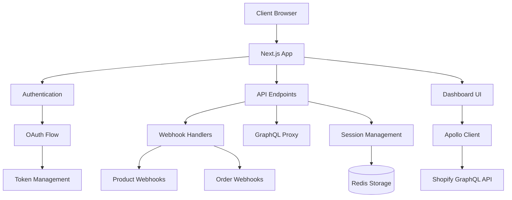
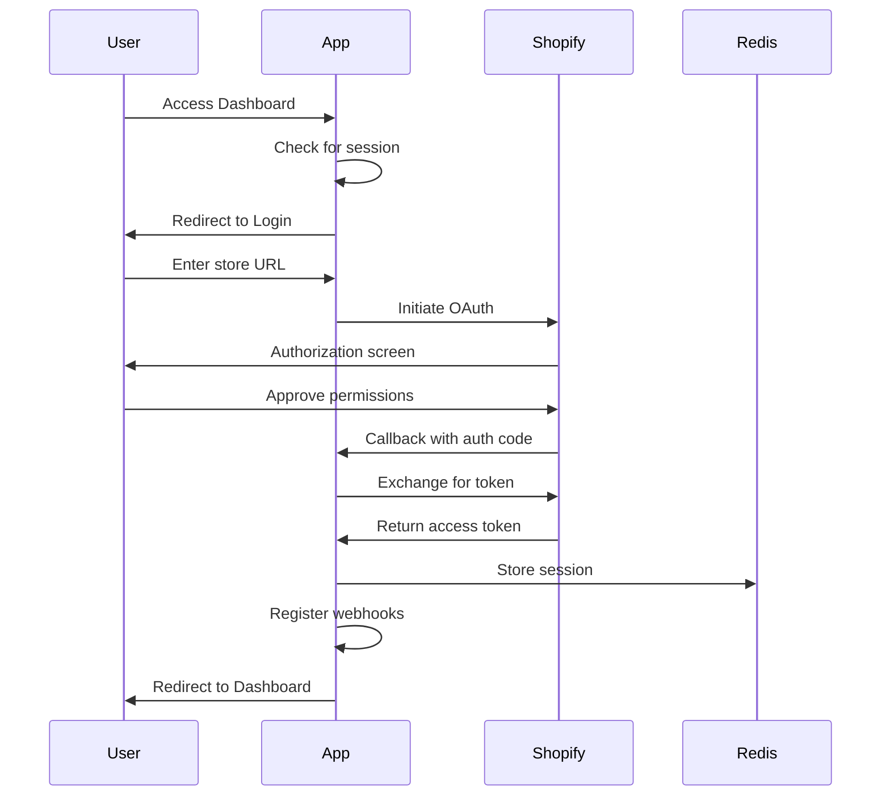

# Shopify Dashboard UI App

A standalone Shopify application built with Next.js, providing a robust platform for Shopify store integration with both online and offline token support.

## 🚀 Application Overview

This application serves as a non-embedded Shopify app, meaning it runs outside the Shopify Admin interface. It provides seamless integration with Shopify stores through OAuth authentication, GraphQL API access, and webhook processing.

### Key Features

- OAuth authentication (both online and offline tokens)
- Session management using Redis
- GraphQL API integration
- Webhook processing system with modular handlers
- Dashboard for store data visualization

## 📋 Architecture



## 🔐 Authentication Flow

The app implements a complete OAuth flow with Shopify:



The application supports both online tokens (user-specific, short-lived) and offline tokens (long-lived, for background tasks).

## 🔄 Webhook System

The app includes a robust webhook handling system:

```mermaid
flowchart LR
Shopify[Shopify] -->|Send webhook| WebhookEndpoint[/api/webhooks]
WebhookEndpoint -->|Validate| Processor[Webhook Processor]
Processor -->|Route to handler| HandlerRegistry[Handler Registry]
HandlerRegistry -->|Execute| ProductHandlers[Product Handlers]
HandlerRegistry -->|Execute| OrderHandlers[Order Handlers]
```

Webhooks are processed through a registry pattern, allowing modular and testable handler implementation for different Shopify events.

## 🛠️ Technical Stack

- **Frontend**: Next.js 15, React 19, TailwindCSS
- **API Integration**: Apollo Client, GraphQL
- **Data Storage**: Upstash Redis
- **Authentication**: Shopify OAuth
- **Deployment**: Vercel ready

## 🚀 Getting Started

1. Clone the repository
2. Install dependencies: `npm install`
3. Create a `.env.local` file with required environment variables:

```bash
   SHOPIFY_API_KEY=your_api_key
   SHOPIFY_API_SECRET_KEY=your_api_secret
   SCOPES=read_products,write_products,read_orders
   HOST=your_app_url
   UPSTASH_REDIS_REST_URL=your_redis_url
   UPSTASH_REDIS_REST_TOKEN=your_redis_token
```

4. Start development server: `npm run dev`
5. For local testing with Shopify, run: `npm run dev:ngrok` (requires NGROK_AUTH_TOKEN in environment)

## 📁 Project Structure

```bash
src/
├── app/ # Next.js App Router components
│ ├── api/ # API endpoints
│ │ ├── auth/ # Authentication endpoints
│ │ ├── graphql/ # GraphQL proxy
│ │ ├── session/ # Session management
│ │ └── webhooks/ # Webhook processing
│ ├── dashboard/ # Dashboard page
│ └── login/ # Login page
├── components/ # Reusable UI components
├── lib/ # Utility functions and setup
│ ├── apollo.ts # Apollo client configuration
│ ├── session.ts # Session storage management
│ ├── shopify.ts # Shopify API setup
│ └── webhooks/ # Webhook handler modules
└── middleware.ts # Next.js middleware for auth
```

## 🔒 Session Management

Sessions are stored in Redis with the Upstash client. Session IDs follow the format `offline_{shop}` to ensure persistent access across user sessions.

## 📊 Dashboard

The application includes a dashboard that displays shop information and can be extended with custom reports and visualizations using GraphQL queries to the Shopify API.

## 🔗 API Endpoints

- `/api/auth`: Initiates the OAuth flow
- `/api/auth/callback`: Handles OAuth callback
- `/api/auth/offline`: Initiates offline token flow
- `/api/auth/offline/callback`: Handles offline OAuth callback
- `/api/webhooks`: Processes incoming webhooks
- `/api/graphql`: Proxy for Shopify GraphQL API
- `/api/session`: Retrieves current session info

## 📝 License

[MIT License](LICENSE)

## 🤝 Contributing

Contributions welcome! Please feel free to submit a Pull Request.
